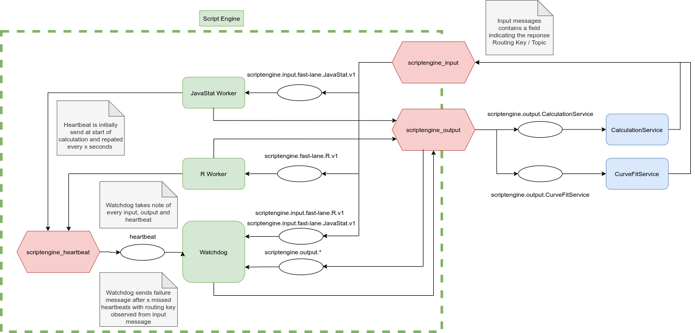

# Phaedra 2 Script Engine

This repository contains all components of the Script Engine of Phaedra 2.

## Diagram

## Components

- **client**: client library that can be used to interact with the Script
  Engine.
- **dto**: DTO classes used by the client, workers and watchdog
- **java-stat-worker**: implementation of a worker that supports our custom `JavaStat` language. Currently, this is used to calculate FeatureStats.
- **r-worker**: implementation of a worker that supports `R`. This is not tied
  to any special use-case.
- **watchdog**: standalone component that keeps track of executed scripts and
  their output and heartbeats. When a script is running but no heartbeats are
  received, it sends a `RESCHEDULED_BY_WATCHDOG` output to the configured output
  queue (e.g. CalculationService).
- **worker**: base for any implementation of a worker.
